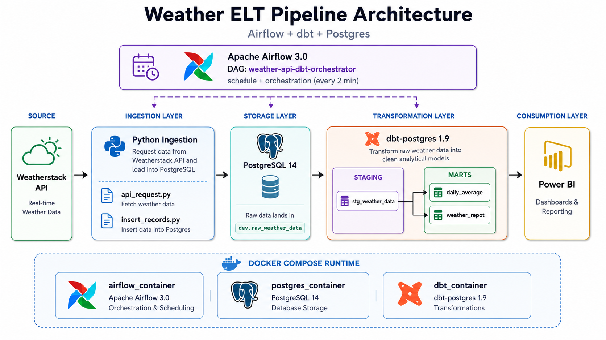

# Weather ELT Pipeline — Airflow + dbt + Postgres

An end-to-end **ELT data pipeline** that ingests live weather data from the [Weatherstack API](https://weatherstack.com/), loads it into **PostgreSQL**, transforms it with **dbt**, and orchestrates the whole flow with **Apache Airflow** — all running locally in **Docker**.

The final mart tables are ready to be consumed by BI tools such as **Power BI** for dashboards and reporting.

---

## Architecture

<p align="center">
  
</p>
---

## Tech stack

| Layer          | Tool                          |
| -------------- | ----------------------------- |
| Ingestion      | Python 3, `requests`, `psycopg2` |
| Storage        | PostgreSQL 14                 |
| Transformation | dbt-postgres 1.9              |
| Orchestration  | Apache Airflow 3.0            |
| Runtime        | Docker Compose                |
| BI (optional)  | Power BI Desktop              |

---

## Project structure

```
weather-data-project/
├── airflow/
│   └── dags/
│       └── orchestrator.py          # DAG: ingest → dbt run
├── api-request/
│   ├── api_request.py               # Weatherstack API client
│   └── insert_records.py            # Loads rows into Postgres
├── dbt/
│   └── my_project/
│       ├── models/
│       │   ├── sources/sources.yml
│       │   ├── staging/stg_weather_data.sql
│       │   └── mart/
│       │       ├── daily_average.sql
│       │       └── weather_repot.sql
│       ├── dbt_project.yml
│       └── profiles.yml
├── postgres/
│   └── airflow_init.sql             # Creates airflow metadata DB
├── docker-compose.yml               # Postgres + Airflow + dbt services
├── .env.example                     # Template for secrets (copy to .env)
└── .gitignore
```

---

## Getting started

### Prerequisites

- [Docker Desktop](https://www.docker.com/products/docker-desktop/) running
- A free [Weatherstack API key](https://weatherstack.com/signup/free)

### 1. Clone the repo

```bash
git clone https://github.com/HUSSAMX7/weather-elt-airflow-dbt.git
cd weather-elt-airflow-dbt
```

### 2. Configure environment variables

Copy the template and add your API key:

```bash
cp .env.example .env
```

Edit `.env`:

```env
WEATHERSTACK_API_KEY=your_real_key_here
WEATHER_CITY=New York
POSTGRES_DB=db
POSTGRES_USER=db_user
POSTGRES_PASSWORD=db_password
```

> The `.env` file is git-ignored — your secrets stay local.

### 3. Start the stack

From the project root:

```bash
docker compose up -d
```

This starts three containers:

| Container          | Purpose                       | Port         |
| ------------------ | ----------------------------- | ------------ |
| `postgres_container` | Data warehouse               | `localhost:5000` |
| `airflow_container`  | Scheduler + webserver        | `localhost:8000` |
| `dbt_container`      | dbt CLI (idle, on-demand)    | —            |

### 4. Open the Airflow UI

Visit **http://localhost:8000**. The DAG `weather-api-dbt-orchestrator` runs automatically every 2 minutes.

The initial Airflow admin password is printed in the container logs:

```bash
docker logs airflow_container | grep -i password
```

### 5. Inspect the data

Connect any SQL client (or Power BI) to PostgreSQL:

- **Host**: `localhost`
- **Port**: `5000`
- **Database**: `db`
- **User**: `db_user`
- **Password**: `db_password`

Query the built models:

```sql
SELECT * FROM dev.weather_repot;
SELECT * FROM dev.daily_average ORDER BY date DESC;
```

---

## dbt models

### Staging

- **`stg_weather_data`** — deduplicates raw records by `time` and converts `insert_at` into local time using `utc_offset`.

### Mart

- **`weather_repot`** — clean per-reading snapshot (`city`, `temperature`, `weather_descriptions`, `wind_speed`, `weather_time_local`).
- **`daily_average`** — daily aggregates: `avg_temperature`, `avg_wind_speed` per city.

Run them manually:

```bash
docker exec dbt_container dbt run
```

---

## Connecting to Power BI

1. Install the [Npgsql provider](https://github.com/npgsql/Npgsql/releases) (enable **GAC Installation**).
2. Power BI Desktop → **Get Data → PostgreSQL database**
3. Server: `localhost:5000`, Database: `db`
4. Choose **DirectQuery** for live dashboards (data refreshes every 2 minutes).

---

## Useful commands

```bash
# Stop everything
docker compose down

# Reset the database (wipes data)
docker compose down -v

# Tail Airflow logs
docker logs -f airflow_container

# Run dbt ad-hoc
docker exec dbt_container dbt run
docker exec dbt_container dbt test
```

---

## Roadmap

- [ ] Support multiple cities via a list in `.env`
- [ ] Add dbt tests for null / uniqueness
- [ ] Publish a sample Power BI `.pbix` file
- [ ] Use Airflow Variables/Connections instead of hard-coded DB creds
- [ ] CI: run `dbt compile` on every PR

---

## License

MIT — feel free to fork and adapt.
